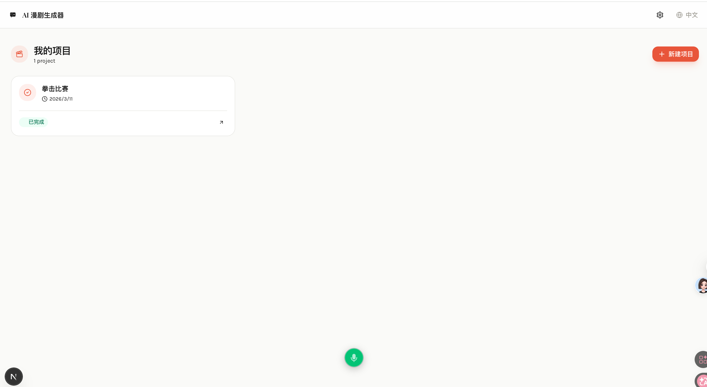
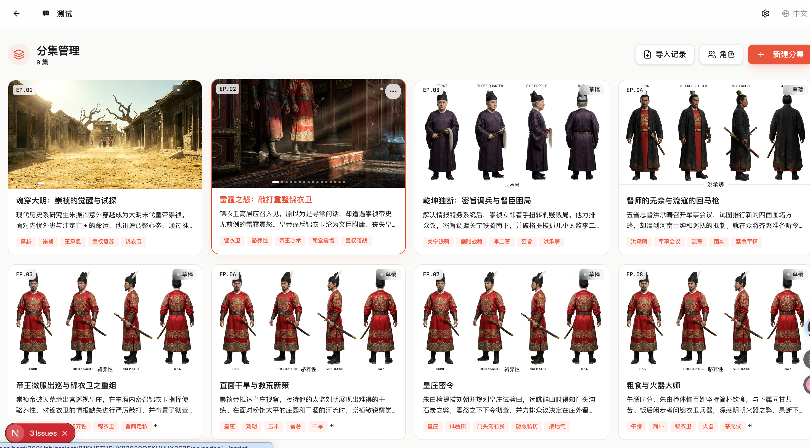
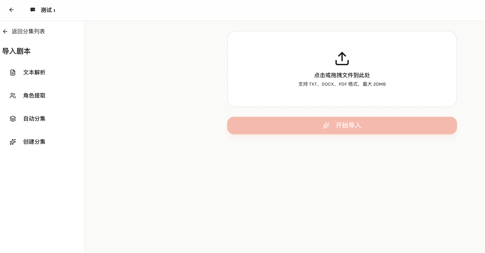
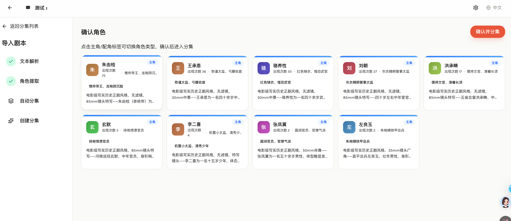
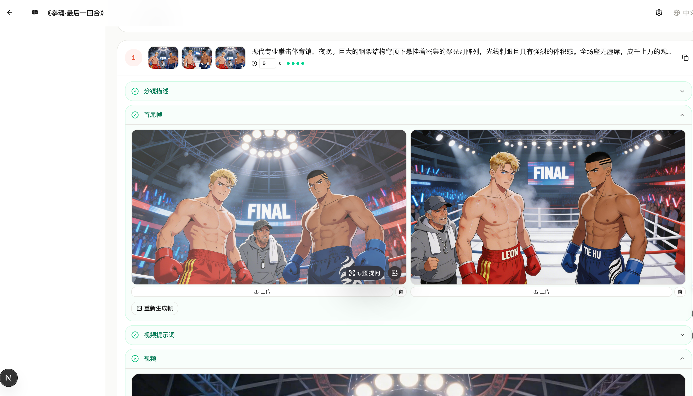
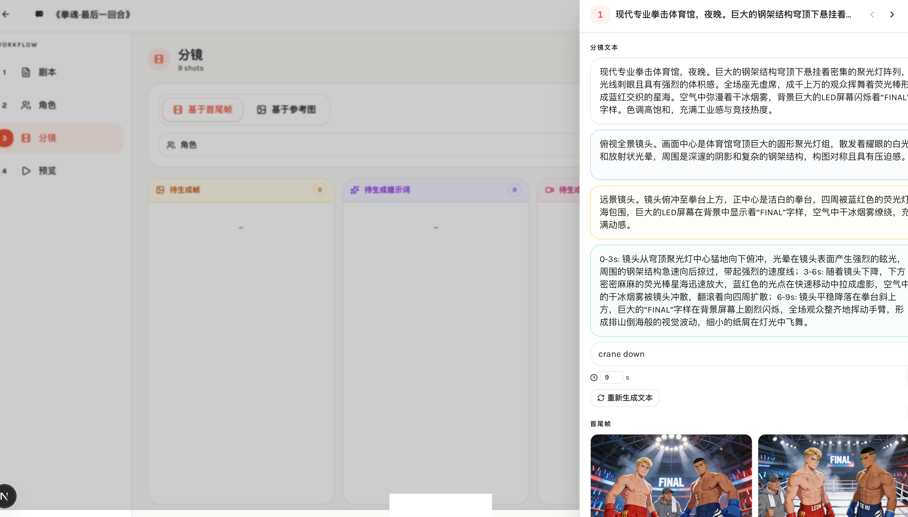
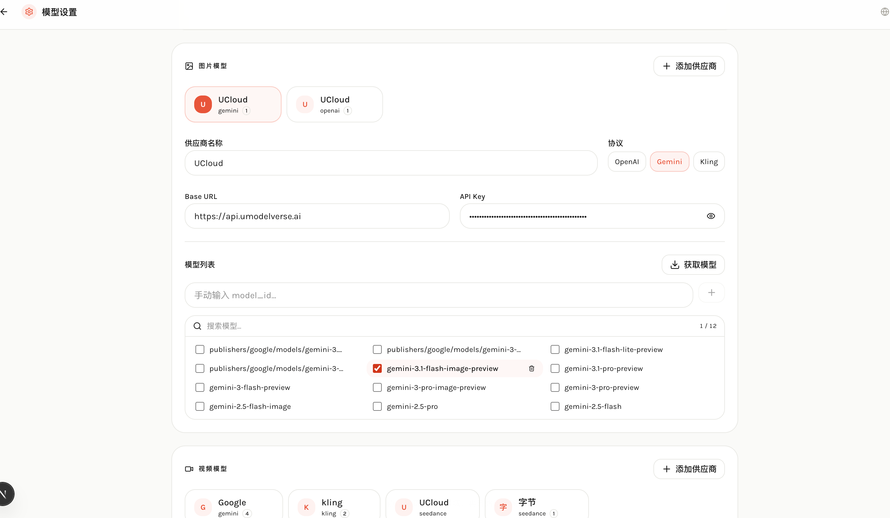
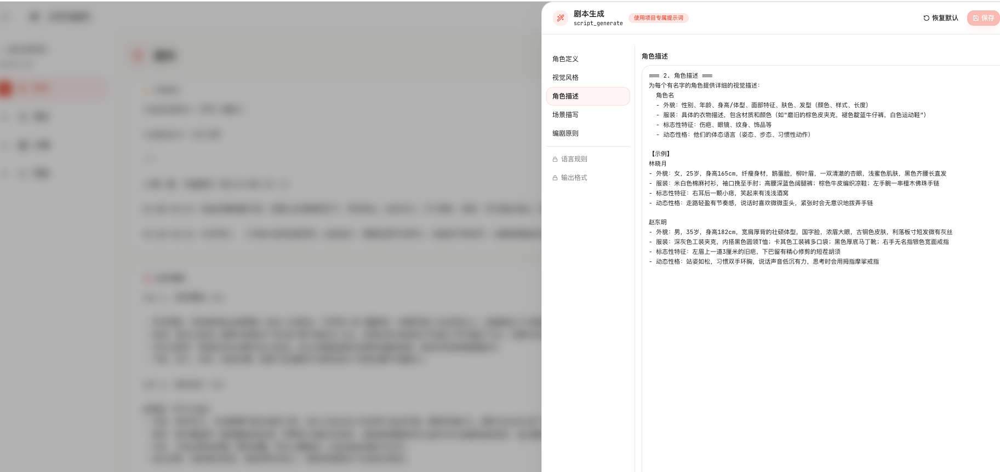
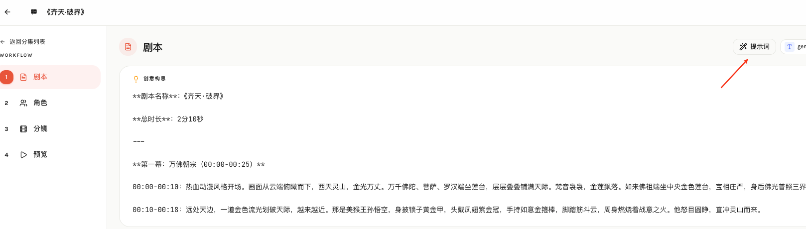

# AI漫剧工坊

**AI Comic Studio** (`ai-comic-studio`) — 开源漫剧（manju）工作流：从剧本到分镜、首尾帧、视频与合成。

| | |
|---|---|
| **GitHub** | [github.com/neilalexanderlee/ai-comic-studio](https://github.com/neilalexanderlee/ai-comic-studio) |
| **npm 包名** | `ai-comic-studio` |
| **建议本地目录** | `ai-comic-studio`（见 [docs/OPEN_SOURCE.md](./docs/OPEN_SOURCE.md)） |

社区交流：[https://linux.do/](https://linux.do/)

> v0.2.2

AI 驱动的漫剧工坊 — 从剧本到动画视频的全自动流水线。

📺 **系统介绍 / Demo**：[Bilibili — AI漫剧工坊](https://b23.tv/3xzE8uz)

> 基于 [AIComicBuilder](https://github.com/twwch/AIComicBuilder)（Apache-2.0）演进。上游致谢与版权说明见 [NOTICE](./NOTICE)。

添加飞书群：


本网站全程由 AI 驱动开发， 开发指南：https://github.com/twwch/vibe-coding


## 功能特性

- **剧本导入** — 支持上传 TXT/DOCX/PDF 文件，AI 自动解析文本、提取角色、智能分集，流程可视化
- **分集管理** — 项目级分集列表，角色按集关联，支持手动创建或导入自动分集
- **角色管理** — 项目级角色管理，主角/配角分区展示，支持跨集复用和按集独立解析
- **剧本创作** — 手动编写或 AI 辅助生成剧本
- **角色提取** — AI 自动从剧本中提取角色并生成详细视觉描述
- **角色四视图** — 为每个角色生成四视图参考图（正面/四分之三/侧面/背面），确保后续帧画面一致性
- **智能分镜** — AI 将剧本拆解为专业镜头列表（含构图、灯光、运镜指令）
- **首尾帧生成** — 为每个镜头生成起始帧和结束帧关键画面（首尾帧模式 / 场景参考帧模式）
- **视频提示词** — AI 基于分镜描述和参考帧自动生成视频提示词，支持直接编辑
- **视频生成** — 基于首尾帧插值生成动画视频片段
- **视频合成** — 将所有片段拼接为完整动画，支持字幕烧录
- **分镜工作流** — 分镜编辑抽屉、角色内联面板、看板视图三种协作视图，支持单张分镜精细编辑
- **帧图管理** — 生成帧支持手动上传替换及一键清除
- **资源下载** — 支持最终视频下载及全部素材打包下载
- **多语言** — 中文 / English / 日本語 / 한국어
- **风格自适应** — 自动识别剧本风格（动漫/写实等），角色四视图与首尾帧生成均匹配对应风格
- **视频比例** — 支持 16:9 / 9:16 / 1:1 / 自适应比例，首尾帧与视频生成统一比例
- **多模型** — 支持 OpenAI、Gemini、Kling、Seedance、Veo 等多家 AI 供应商，可按项目配置
- **密钥后端存储** — 模型 API Key/Secret Key 通过后端接口写入数据库，不再持久化在浏览器 localStorage/sessionStorage

## 技术栈

| 层级 | 技术 |
|------|------|
| 框架 | Next.js 16 (App Router) |
| 前端 | React 19, Tailwind CSS 4, Zustand, Base UI |
| 国际化 | next-intl |
| 数据库 | SQLite + Drizzle ORM |
| AI 文本 | OpenAI / Gemini (via AI SDK) |
| AI 图像 | OpenAI DALL-E / Gemini Imagen / Kling |
| AI 视频 | Seedance / Kling / Veo |
| 视频处理 | FFmpeg (fluent-ffmpeg) |
| 包管理 | pnpm |

## 快速开始

### 本地开发（推荐）

热更新亚秒级响应，适合日常开发。

**前置依赖：** Node.js 18+、pnpm、FFmpeg

```bash
# macOS
brew install ffmpeg

# Ubuntu / Debian
sudo apt install ffmpeg
```

```bash
pnpm install
pnpm drizzle-kit push   # 初始化数据库（首次）
pnpm dev                # 启动开发服务器
```

访问 [http://localhost:3007](http://localhost:3007)

### Docker 部署（生产）

```bash
make build    # 构建镜像并启动
make up       # 仅启动（镜像已构建）
make down     # 停止
make logs     # 查看日志
```

数据通过 volume 持久化：`./data`（数据库）、`./uploads`（媒体文件）。

## 生成流水线

```
剧本输入 → 剧本解析 → 角色提取 → 角色四视图
                                      ↓
                                   智能分镜
                                      ↓
                         参考帧生成 / 首尾帧生成（逐镜头）
                                      ↓
                              视频提示词生成（逐镜头）
                                      ↓
                              视频生成（逐镜头）
                                      ↓
                                 视频合成 + 字幕
```

每个阶段支持单独触发或批量生成，用户可完全控制流水线节奏。分镜页提供列表视图和看板视图，看板按生成进度自动分列。支持分镜版本管理，可创建多个版本进行对比迭代。

## 项目结构

```
src/
├── app/
│   ├── [locale]/                # i18n 路由
│   │   ├── (dashboard)/         # 项目列表
│   │   ├── project/[id]/        # 项目编辑器
│   │   │   ├── script/          # 剧本编辑
│   │   │   ├── characters/      # 角色管理
│   │   │   ├── storyboard/      # 分镜面板
│   │   │   └── preview/         # 预览 & 合成
│   │   └── settings/            # 模型配置
│   └── api/                     # API 路由
├── components/
│   ├── ui/                      # 基础 UI 组件
│   ├── editor/                  # 编辑器组件
│   └── settings/                # 设置组件
├── lib/
│   ├── ai/                      # AI 供应商 & Prompt
│   ├── pipeline/                # 生成流水线
│   ├── db/                      # 数据库 Schema
│   └── video/                   # FFmpeg 处理
└── stores/                      # Zustand 状态管理
```

## 数据模型

- **Project** — 项目（剧本、状态）
- **Character** — 角色（名称、描述、参考图）
- **Shot** — 镜头（序号、提示词、时长、首尾帧、视频）
- **Dialogue** — 对白（角色、文本、音频）
- **Task** — 后台任务队列

## 界面截图

| 项目列表 | 分集管理 |
|:---:|:---:|
|  |  |

| 剧本导入 | 导入 — 角色解析 | 导入 — 自动分集 |
|:---:|:---:|:---:|
|  |  |  |

| 角色管理 | 剧本生成 |
|:---:|:---:|
|  |  |

| 角色解析 | 分镜 | 分镜看板 |
|:---:|:---:|:---:|
|  |  |  |

| 看板 | 看板详情 |
|:---:|:---:|
|  |  |

| 预览 | 模型配置 |
|:---:|:---:|
|  |  |

| 提示词管理 | 提示词修改 |
|:---:|:---:|
|  |  |

| 提示词快捷入口 | 分镜 AI 优化 |
|:---:|:---:|
|  |  |

## Demo

[Bilibili — AI漫剧工坊](https://b23.tv/3xzE8uz)

## 模型配置（重要）

首次使用需要在设置页配置模型供应商。

### 支持的供应商

| 供应商 | 支持能力 | 需要的密钥 |
|--------|----------|------------|
| OpenAI | 文本、图像 | OpenAI API Key |
| Gemini | 文本、图像、视频 | Gemini API Key |
| Seedance | 视频 | Seedance API Key |
| Kling | 图像、视频 | Access Key + Secret Key |
| Veo | 视频 | 通过 Gemini 体系使用 |

### 配置步骤

1. 打开“设置”页面
2. 添加供应商（OpenAI / Gemini / Seedance / Kling）
3. 填写 `name`、`baseUrl`、`apiKey`（Kling 还需要 `secretKey`）
4. 点击“获取模型列表”并勾选可用模型
5. 设为默认文本/图像/视频模型

### 密钥安全说明

- 密钥保存到后端数据库，不再存储在浏览器 localStorage/sessionStorage
- 刷新页面、重开浏览器后模型配置仍然有效
- 建议仅在受信任设备上使用，定期轮换 API Key

## 使用流程

1. 创建项目（选择比例与生成模式）
2. 输入或导入剧本（TXT / DOCX / PDF）
3. 角色提取与分镜生成
4. 帧图生成（首尾帧或场景参考帧）
5. 视频生成与最终合成

## 数据与目录

| 路径 | 说明 |
|------|------|
| `./data/aicomic.db` | SQLite 数据库 |
| `./uploads/` | 媒体文件 |
| `./uploads/frames/` | 帧图片 |
| `./uploads/videos/` | 视频片段和成片 |

## 安全与隐私说明

### 部署边界

- 推荐本机或受信内网使用，不要直接暴露公网
- Docker 端口示例默认绑定 `127.0.0.1:3007:3007`（仅本机访问）

### 日志与第三方上报

- Prompt/脚本相关日志已做降敏处理，不再打印完整 system prompt / promptRequest / videoPrompt
- 项目代码中未发现 Sentry / PostHog / Mixpanel / Datadog 等第三方日志上报

### 模型调用数据流

- 输入的剧本、提示词、参考图会发送到你配置的模型供应商执行生成任务
- 生成媒体保存在本地 `uploads` 目录

## 故障排查

### Q1：`better-sqlite3` 报错

```bash
pnpm rebuild better-sqlite3
```

### Q2：找不到 FFmpeg

```bash
ffmpeg -version
```

### Q3：模型调用提示 Key 无效

- 检查 Key 是否正确、是否过期、是否有余额/配额
- 在设置页重新保存该 Provider 的密钥后再重试

### Q4：视频生成慢或超时

- 降低并发批量
- 缩短时长
- 检查网络和目标模型服务状态

## 环境变量参考

| 变量 | 默认值 | 说明 |
|------|--------|------|
| `DATABASE_URL` | `file:./data/aicomic.db` | SQLite 数据库路径 |
| `UPLOAD_DIR` | `./uploads` | 上传与生成媒体目录 |
| `OPENAI_API_KEY` | - | OpenAI Key |
| `OPENAI_BASE_URL` | - | OpenAI/兼容 API 基础地址 |
| `OPENAI_MODEL` | - | 默认 OpenAI 文本模型 |
| `GEMINI_API_KEY` | - | Gemini Key |
| `SEEDANCE_API_KEY` | - | Seedance Key |
| `SEEDANCE_BASE_URL` | `https://ark.cn-beijing.volces.com/api/v3` | Seedance 地址 |
| `SEEDANCE_MODEL` | - | 默认 Seedance 模型 |
| `KLING_ACCESS_KEY` | - | Kling Access Key |
| `KLING_SECRET_KEY` | - | Kling Secret Key |
| `KLING_BASE_URL` | `https://api.klingai.com` | Kling 地址 |

## 系统架构

### 总体架构

- 基于 Next.js App Router 的全栈单体应用（前后端同仓）。
- 前端负责项目编辑、配置与触发生成；后端 API 负责模型调用、任务编排、数据落库。
- 数据层使用 SQLite + Drizzle ORM；媒体文件落在本地 `uploads`。

### 目录结构（核心）

```text
src/
├── app/                      # 页面与 API 路由
│   ├── [locale]/             # 国际化页面路由
│   └── api/                  # 后端 API
├── components/               # 页面/业务组件
├── lib/
│   ├── ai/                   # Provider 实现、提示词模板、工厂
│   ├── db/                   # schema 与数据库连接
│   ├── pipeline/             # 各阶段流水线逻辑
│   ├── task-queue/           # 后台任务队列
│   └── video/                # ffmpeg 封装
├── stores/                   # Zustand 状态管理
└── i18n/                     # 国际化配置
```

### 关键数据模型

- `projects`：项目主表（标题、剧本、状态、模式、成片地址）
- `episodes`：分集信息（序号、描述、关键词、状态）
- `characters`：角色信息（描述、视觉提示、参考图）
- `shots`：镜头信息（提示词、首尾帧、视频、状态）
- `dialogues`：对白
- `tasks`：异步任务队列
- `provider_secrets`：模型密钥后端存储（按 `userId + providerId` 关联）

### 核心 API（按职责）

- 项目管理：`/api/projects/*`
- 统一生成入口：`POST /api/projects/[id]/generate`（通过 `action` 分发）
- 剧本导入：`/api/projects/[id]/upload-script` 与 `/api/projects/[id]/import/*`
- 资源访问：`/api/uploads/[...path]`
- 模型相关：`/api/models/list`、`/api/provider-secrets/*`
- 提示词系统：`/api/prompt-templates/*`、`/api/prompt-presets/*`

### AI Provider 架构

- Provider 工厂在 `src/lib/ai/provider-factory.ts`，按配置分发到 OpenAI / Gemini / Seedance / Kling / Veo。
- 文本、图像、视频调用走统一抽象接口，便于切换供应商。
- 提示词模板在 `src/lib/ai/prompts/`，支持槽位化编辑与版本化管理。

### 任务与媒体处理

- 生成任务通过 `src/lib/task-queue/` 执行（支持状态跟踪与重试）。
- 视频后处理由 `src/lib/video/ffmpeg.ts` 完成（拼接、字幕烧录等）。
- 所有媒体默认落地本地 `uploads`，再通过 API 路由提供访问。

### 国际化与状态管理

- 国际化：`next-intl`，支持 zh/en/ja/ko。
- 前端状态：Zustand（项目、分集、模型配置、提示词编辑状态等）。


## License

本项目采用 [Apache License 2.0](./LICENSE)。

- 版权与衍生说明：[NOTICE](./NOTICE)
- 首次开源 / 改目录名 / 推送 GitHub：[docs/OPEN_SOURCE.md](./docs/OPEN_SOURCE.md)


