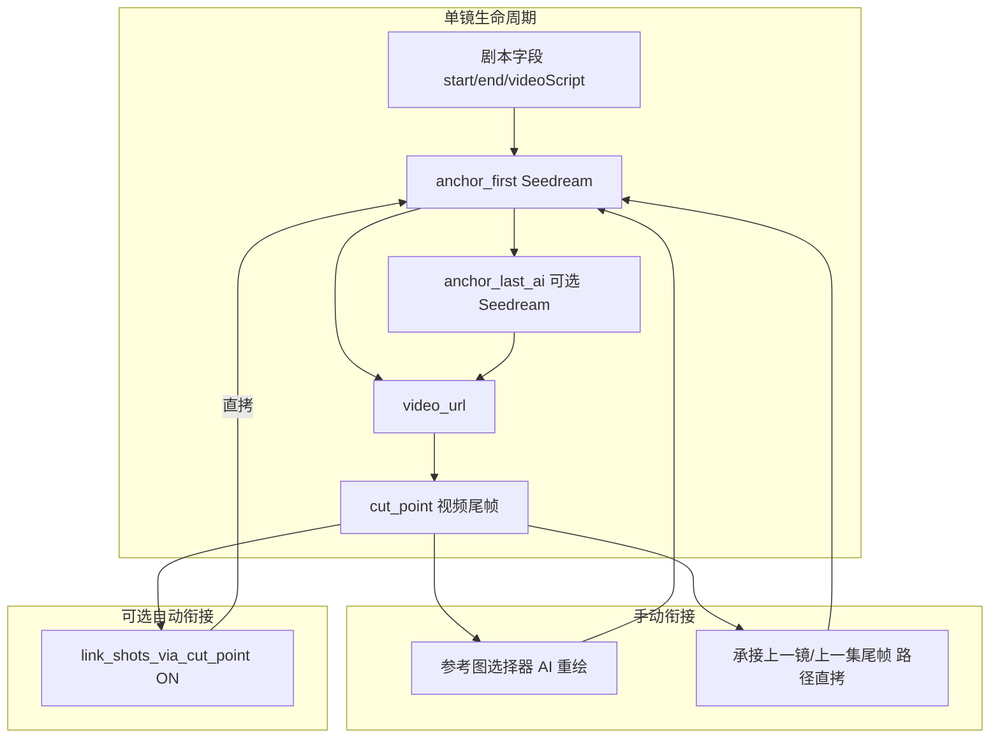

# 分镜帧与视频工作流 — 架构说明

> 用户操作见 [WORKFLOW.md](./WORKFLOW.md)。系统全景见 [ARCHITECTURE.md](./ARCHITECTURE.md)。  
> 本文是 **帧/视频字段含义与镜间衔接规则** 的单一事实来源（2026-05，与代码同步）。

---

## 0. 「Plan B」是什么？（先读这一节）

**Plan B** 是开发文档里的**内部代号**，指 **2026-03～05 一轮分镜帧语义改版之后、当前正在使用的方案**。  
你在界面里**不会**看到「Plan B」字样；助手或迁移文件里出现这个词时，指的就是**下面这套规则**。

### 和旧方案（文档里偶称 Plan A）差在哪

| 维度 | 旧方案（已废弃） | 当前方案（Plan B / 本文） |
|------|------------------|---------------------------|
| 数据库字段名 | `first_frame`、`last_frame`、`seedance_last_frame` 等混用 | `anchor_first`、`anchor_last_ai`、`cut_point`（见 §1） |
| 生成画面前 | 常自动把上一镜尾帧当下镜首帧 | **不自动**；默认独立生成，可选手动参考图或「承接上一镜」 |
| 视频尾帧存哪 | 有时写 `last_frame`，与 AI 尾帧混淆 | **只**写入 `cut_point`；AI 尾帧只在 `anchor_last_ai` |
| 镜间接续 | 批量链式、一键续跑、隐式链式较多 | 默认手动；可选项目开关「镜头衔接（视频尾帧）」自动直拷 |
| 参考图模式双轨 | `sceneRefFrame` + Reference 视频管线 | 已删；统一为「首帧 + 可选 AI 尾帧」驱动 Seedance |
| 批量生成 | 批量帧/批量视频按钮 | 已移除（API 410）；保留「批量视频提示词」 |

**你只需要记住：** 制作时以 [WORKFLOW.md](./WORKFLOW.md) 为准；争论「这个字段该不该写进下一镜」时查 **本文 §1～§2**。

数据库迁移：`drizzle/0029_shot_frame_semantics.sql`（字段重命名）、`0030`（衔接开关）、`0033`（删除废弃列 `last_frame_url`）。

---

## 1. 三个资产字段（当前方案）

| 字段 | 含义 | 谁写入 | 用途 |
|------|------|--------|------|
| `anchor_first` | 本镜 **Seedream 生成** 的首帧（构图锚点） | `single_frame_generate` / 上传 / 手动衔接 | 驱动 Seedance **输入**；UI「首帧」格 |
| `anchor_last_ai` | **Seedream 生成** 的尾帧（动作终点预测，可选） | 同上（`resolveFrameMode` 为 `both` 时） | 有磁盘文件时 → Seedance **首尾帧插值** 模式 |
| `cut_point` | **视频真实最后一帧**（Seedance `return_last_frame` 下载） | 仅 `single_video_generate` 成功后 | UI「视频尾帧」格；镜间衔接的**权威切点** |

追溯字段（可选）：

| 字段 | 含义 |
|------|------|
| `chain_source_shot_id` | 本镜 `anchor_first` 参考自哪一镜 |
| `chain_source_type` | `anchor_first` \| `anchor_last_ai` \| `cut_point` |

**API 现状：** Seedance 只回传 **最后一帧 URL**，没有「视频真实首帧」回传。从 `.mp4` 抽第 0 帧 **不做**（D7-B）。

---

## 2. 当前实现（与代码一致）

### 2.0 首帧 prompt 语义（`first-frame-prompt.ts` + `frame_generate_first`）

| 字段 | 用途 |
|------|------|
| `startFrameDesc` | **首帧唯一画面依据**（动作开始前的静止态） |
| `prompt`（场景描述） | 镜头整体情节；有 `startFrameDesc` 时仅作「禁止画进首帧」的上下文 |
| `cameraDirection` | 仅 **起幅** 段注入首帧（`→` 后的跳切/特写不进首帧） |
| 群演/无具名角色 | `shotKind=environment`：不用「角色占 40–70%」，改用环境主体渲染块 |
| `frameReference` | `frameReferenceMode=continuity`：参考图按镜间衔接规则，非角色设定图 |

### 2.1 生成画面 `single_frame_generate`

| 参数 | 说明 |
|------|------|
| `frameTarget` | `first` / `last` / `both` |
| `frameReference` | 用户显式 `{ shotId, frameType }` → Seedream 参考图重绘，写 `chain_source_*` |

**无**自动读上一镜尾帧。弹窗默认「独立生成（不参考其他分镜）」。

尾帧：有 `anchor_first` 时 Seedream 生成 `anchor_last_ai`（`both` 或策略 `first_only` 时跳过尾帧）。

### 2.2 生成视频

```
群演镜头 OR 磁盘无有效 anchor_last_ai
  → 首帧参考图模式（仅 anchor_first）
否则
  → 首尾帧模式（anchor_first + anchor_last_ai）
```

视频结束后：**只写本镜 `cut_point`**，不写 `anchor_last_ai`。

若项目开启 **`link_shots_via_cut_point`**（UI「镜头衔接（视频尾帧）」），则在同集同版本内自动：`cut_point[i]` **路径直拷** → `anchor_first[i+1]`（见 §2.5）。

### 2.3 UI 衔接

| 操作 | 行为 | 范围 |
|------|------|------|
| 参考图选择器 | 选他镜三帧之一 → AI 重绘本镜 `anchor_first` | **仅本集** `project.shots`（列表卡或看板→抽屉） |
| 「承接上一镜尾帧」 | `anchor_first = 上一镜 cut_point ?? anchor_last_ai`（**路径直拷**） | **本集上一镜**（`index - 1`） |
| 「承接上一集尾帧」 | 同上，源为上一集最后一镜 | **跨集**（`POST .../adopt-prev-episode-frame`） |
| 「镜头衔接（视频尾帧）」 | 视频成功后自动直拷下一镜 `anchor_first` | 同集同版本；项目级开关，**默认关** |

### 2.4 已删除 / 已废弃能力

| 能力 | 状态 |
|------|------|
| `batch_frame_generate` / `batch_video_generate` | API **410**；分镜页无按钮（镜间需逐镜 + 手动衔接） |
| `batch_chain_generate` | 路由已删 |
| 一键续跑、续上集勾选、单镜生成画面前自动参考上一镜、批量镜间直拷 | 已删 |
| Reference 双轨（`sceneRefFrame` / `referenceVideoUrl` 生成流） | API **410**；分镜页仅 keyframe 流程（D5-A） |
| Worker `frame_generate` / `video_generate` | 未注册 handler；enqueue 同名 action **410**（D4-B） |
| 从 mp4 抽「视频真实首帧」 | 不做（D7-B） |

实现要点：

- 自动衔接：`maybeAutoLinkNextShotAfterVideo` → `linkNextShotAnchorFromCutPoint`（`src/lib/storyboard/shot-frame-link.ts`）
- 跨集：`resolvePreviousEpisodeTailFrame` + `adopt-prev-episode-frame` 路由
- 陈旧路径：分镜卡 `shotFrameFileOnDisk` 检测，**红框 +「文件缺失」**，**不清 DB**（D6-B）

---

## 3. 数据流



---

## 4. 产品决策记录（已落地）

| ID | 决策 | 实现 |
|----|------|------|
| **D1** | **A** — 项目开关「镜头衔接（视频尾帧）」，默认关；视频成功后自动衔接 | `projects.link_shots_via_cut_point`（migration `0030`） |
| **D2** | **B** — 单独按钮「承接上一集尾帧」 | `adopt-prev-episode-frame` |
| **D3** | **A** — 衔接用路径直拷 | `shot-frame-link.ts` |
| **D4** | **B** — 废弃 pipeline frame/video_generate | `pipeline/index.ts` 不注册；generate **410** |
| **D5** | **A** — 删除 reference 双轨 UI/API | 分镜页 keyframe only；reference actions **410** |
| **D6** | **B** — UI 标红缺失帧文件，不自动清 DB | `shot-card.tsx` + `shotFrameFileOnDisk` |
| **D7** | **B** — 不做 mp4 抽首帧 | — |

---

## 5. 推荐工作流

1. 分镜页开启或关闭 **「镜头衔接（视频尾帧）」**（默认关，需要连续落幅时再开）。
2. 镜 N：生成画面 → 生成视频 → 查看 **视频尾帧** 格。
3. 镜 N+1：
   - 衔接开关 **开**：若 N 已有 `cut_point`，视频完成后自动写入 N+1 的 `anchor_first`；
   - 衔接开关 **关**：点 **「承接上一镜尾帧」** 或参考图选 **镜 N · 视频尾帧**。
4. **第二集首镜**：点 **「承接上一集尾帧」**（等同跨集直拷，非批量续上集）。
5. DB 有路径但文件已删：分镜卡 **红框** → 手动重生或上传，系统不会自动清空字段。

---

## 6. 已知限制

| # | 说明 |
|---|------|
| L1 | 参考图选择器仅 **本集当前版本**；跨集用「承接上一集尾帧」，不进选择器 |
| L5 | **看板**= 进度列 + 点开 `ShotDrawer`；抽屉与列表共用 `useShotFrameActions` / `ShotFrameToolbar` / `ShotFrameAssets` |
| L6 | 列表 `ShotCard` 与抽屉共用 `useShotFrameActions`、帧组件、`RemoteVideoRecoveryHint`、`ShotVideoEnhanceButton`；列表另保留字段 AI 优化 |
| L2 | 历史仅 `reference_video_url` 的成片已在迁移 0032 并入 `video_url` |
| L3 | 已删除未注册的 `pipeline/frame-generate.ts` / `video-generate.ts`；生成走 `generate/route` |
| L4 | 自动衔接跳过（如 `crowd_to_character_cut`）会在视频生成后以 **info Toast** 提示；成功衔接为 success Toast（`shot-auto-link-messages.ts`） |

---

## 7. 迁移

- `drizzle/0029_shot_frame_semantics.sql` — 字段语义改版（Plan B）
- `drizzle/0030_link_shots_via_cut_point.sql` — `link_shots_via_cut_point`
- `drizzle/0033_drop_shot_last_frame_url.sql` — 移除废弃列 `last_frame_url`（视频尾帧仅存 `cut_point`）
- 启动时 `bootstrap()` 自动应用
