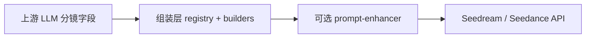

# Prompt 工程架构 — S 级漫剧（单一事实来源）

> 帧/视频资产语义见 [ARCHITECTURE-FRAMES.md](./ARCHITECTURE-FRAMES.md)。操作见 [WORKFLOW.md](./WORKFLOW.md)。  
> 火山方舟文档见 [docs/APIs/](./APIs/)（Seedream 提示词指南、Seedance 提示词指南、Seedream→Seedance 最佳实践）。

---

## 四层流水线

| 层 | 职责 | 代码入口 |
|----|------|----------|
| **1. 上游** | `shot_split` / `shot_complete` / `outline_expand` 写出合规字段 | [registry.ts](../src/lib/ai/prompts/registry.ts) |
| **2. 组装** | 把 DB 字段拼成模型输入；**不**把 `prompt` 当首/尾帧主画面 | [frame-prompt-context.ts](../src/lib/storyboard/frame-prompt-context.ts)、[frame-generate.ts](../src/lib/ai/prompts/frame-generate.ts)、[video-generate.ts](../src/lib/ai/prompts/video-generate.ts) |
| **3. 增强** | 按协议改写；推理链由 [sanitize-model-output.ts](../src/lib/ai/sanitize-model-output.ts) 剥离 | [prompt-enhancer.ts](../src/lib/ai/prompt-enhancer.ts) |
| **4. API** | 图像静帧 / 视频运动 | `generate/route.ts` |

---

## 分镜字段合同（必守）

| 字段 | 语义 | 首/尾帧图像 | 视频 |
|------|------|-------------|------|
| `shot.prompt` | 镜头情节/场景卡（可含将发生的动态） | **仅上下文**，禁止作为主画面 | 理解场次，不重复长人设 |
| `startFrameDesc` | 动作开始前的静止画面 | **首帧主依据** | 可选 Opening 锚点 |
| `endFrameDesc` | 动作结束后的静止收束 | **尾帧主依据** | 可选 Closing 锚点 |
| `videoScript` | Seedance 式运动散文（60–180 字） | 不用 | **默认视频文案** |
| `cameraDirection` | `起幅→…→落幅` 整镜链 | 首帧=起幅、尾帧=落幅（代码截取） | 整句或精炼句 |
| `videoPrompt` | Vision 精炼后的成片 prompt | — | 优先于组装（B2 帧变更后自动刷新） |

编剧原则：**动态情节写进 `videoScript` / `motionScript`，不要写进 `startFrameDesc`/`endFrameDesc` 的对立面。**  
`prompt` 可写场次与将发生的事，但静帧生成以 start/end 为准。

---

## 图像组装（Seedream）

### 首帧 `frame_generate_first`

- 参数：[pickFirstFramePromptBuildParams](../src/lib/storyboard/frame-prompt-context.ts)
- 环境/群演镜（无具名角色）：内置 `FIRST_FRAME_RENDERING_QUALITY_ENVIRONMENT`，**无**「角色占 40–70%」
- 镜间参考图：`FIRST_FRAME_CONTINUITY_REFERENCE_RULES`（非设定图四视图文案）
- 运镜：仅 `extractOpeningCameraDirection`

### 尾帧 `frame_generate_last`

- 参数：`pickLastFramePromptBuildParams`
- 主画面：`endFrameDesc`；`prompt` 降级为「禁止画进尾帧」的上下文
- 运镜：仅 `extractClosingCameraDirection`
- 参考图：首帧图 + 设定图；保留 slot `relationship_to_first`

### 提示词管理 UI

- 编辑的是 registry **默认插槽**；用户自定义插槽会覆盖默认文案。
- **环境镜**走代码内置渲染块，与插槽里「角色占 40–70%」无关。
- 改版后可在插槽页「恢复默认」同步新文案。

### 增强开关 `enhancePrompts`

- doubao/Seedream：组装器先出完整 prompt；增强前经 [compress-frame-prompt-for-enhance.ts](../src/lib/storyboard/compress-frame-prompt-for-enhance.ts) **摘摘要**，再由 LLM 输出 **≤180 字** 逗号分隔静帧句（`视频静帧画面。` 开头）；失败回退**未增强的组装结果**（非增强输出）。
- 关闭 `enhancePrompts` 时：直接发送组装器结果（仍建议保持 start/end 字段合规）。

---

## 视频组装（Seedance / Kling）

原则（见 [seedance-prompt-patterns.md](./seedance-prompt-patterns.md)）：**图像已见角色时，文字只写发生什么。**

| 模式 | 条件 | 组装 |
|------|------|------|
| 首尾帧插值 | 有效 `anchor_last_ai` | [buildVideoPrompt](../src/lib/ai/prompts/video-generate.ts)；弱化角色块；简化 FRAME ANCHORS |
| 首帧参考 | 群演 / 无 AI 尾帧 | [buildReferenceVideoPrompt](../src/lib/ai/prompts/video-generate.ts) |
| Vision 精炼 | 按钮或 **B2 自动** | [ref-video-prompt-generate.ts](../src/lib/ai/prompts/ref-video-prompt-generate.ts) → 写入 `videoPrompt` |

### B2：条件自动刷新 `videoPrompt`

- 字段：`shots.video_prompt_frame_fingerprint`（路径 + mtime 指纹）
- 触发：`single_video_generate` 前，若无 `videoPrompt` 或指纹与当前帧不一致 → 自动 vision 精炼
- 手动「生成视频提示词」始终可用

---

## 已移除的 Reference 双轨（不再出现在提示词管理）

2026-05 起已从 `PROMPT_REGISTRY` 删除（避免与 Plan B 混淆）：

| 原 Key | 说明 |
|--------|------|
| `scene_frame_generate` | 旧「场景参考帧」；现由 `frame_generate_first` + `anchor_first` 替代 |
| `ref_video_generate` | 旧「参考视频」对白插槽；现 `buildReferenceVideoPrompt` 共用 `video_generate.dialogue_format` |

对应 API（`single_scene_frame`、`single_reference_video` 等）仍返回 **410**。DB 里若仍有这两类的自定义插槽覆盖，可手动删除或忽略。

---

## 产品决策（已落地）

| ID | 决策 |
|----|------|
| **A** | A1 组装层 + A2 上游文案（`shot_split` / `shot_complete` / WORKFLOW） |
| **B** | B2 有帧且 prompt 过期时自动 vision 精炼 |

---

## 迁移

- `drizzle/0034_video_prompt_frame_fingerprint.sql` — `video_prompt_frame_fingerprint`
